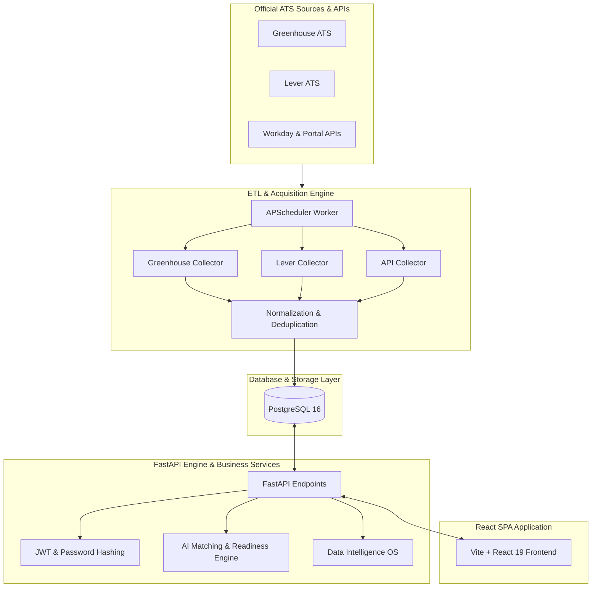
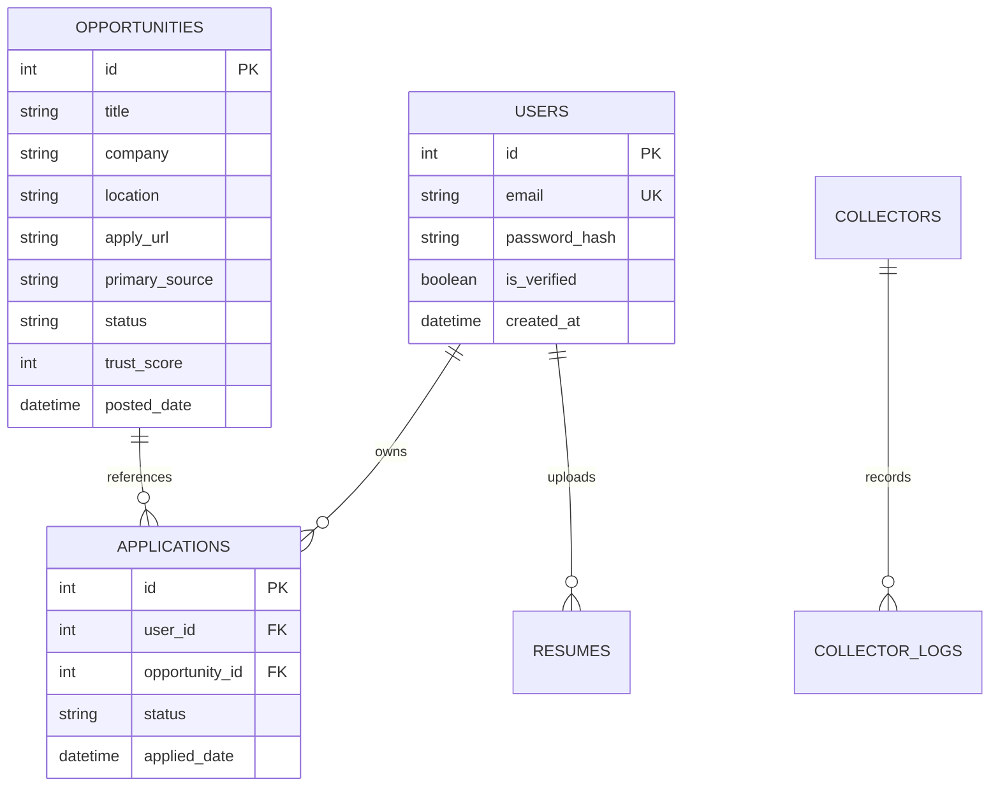

# CareerLens AI (v1.0.0)

> **Data-Driven Career Intelligence & Autonomous Opportunity Acquisition Engine**

CareerLens AI is an end-to-end autonomous career intelligence platform engineered to eliminate job search opacity. It aggregates verified job opportunities directly from official corporate career ATS portals, scores role readiness using AI matching algorithms, curates targeted skill paths, and provides real-time data telemetry for job seekers and hiring trends.

---

## 🌟 Why CareerLens AI?

The modern job search landscape suffers from widespread ghost jobs, stale postings, third-party aggregator spam, and mismatched skill requirements. **CareerLens AI** addresses these problems at the root:

1. **Direct Official ATS Acquisition**: Collects job data straight from corporate Greenhouse, Lever, Workday, SmartRecruiters, and custom API endpoints—filtering out unverified aggregators.
2. **Explainable AI Matching**: Evaluates candidate readiness using multi-vector skill coverage, resume relevance, and experience scoring rather than black-box algorithms.
3. **Adaptive Pipeline Telemetry**: Continuously monitors collector health, source yields, link integrity status, and pipeline execution schedules in real time.

---

## 🛠️ Technology Stack

| Layer | Technologies Used |
| :--- | :--- |
| **Frontend** | React 19, Vite, Tailwind CSS 4, React Router 7, Material Symbols |
| **Backend API** | Python 3.11+, FastAPI, Pydantic v2, Uvicorn, SQLAlchemy |
| **Database** | PostgreSQL 16, Alembic Migrations |
| **ETL & Scheduling** | Autonomous Collectors, APScheduler (Background Async Worker) |
| **Email Service** | Resend Transactional Email API |
| **Cloud Hosting** | Render (API & Worker & PostgreSQL), Vercel (Frontend SPA) |

---

## 🏗️ Architecture & Data Pipeline



---

## ⚡ Key Features

- 🎯 **Opportunities Hub**: Multi-filter job search (search text, location, job type, experience, relevance) with link integrity tracking and lifecycle status indicators.
- 📊 **Career Readiness Diagnostics**: Quantifies skill coverage %, resume alignment %, and experience compatibility score for targeted roles.
- 🚀 **Data Intelligence OS**: Telemetry dashboard providing health metrics, active alerts, source yield breakdown, and collector status tracking.
- 🎓 **Learn Skills & Resources Engine**: Market-backed skill recommendation paths with curated resources and certifications.
- 🔐 **Secure Authentication**: JWT session management, email verification via Resend, and password recovery.

---

## 🗄️ Database Schema & Key Entities



---

## 📂 Project Structure

```
CareerLens-AI/
├── backend/
│   ├── app/
│   │   ├── api/          # FastAPI route handlers & endpoints
│   │   ├── core/         # Security, JWT, config & settings
│   │   ├── db/           # SQLAlchemy models & session
│   │   ├── services/     # Matching engine, email, intelligence
│   │   └── scheduler/    # APScheduler background ETL collector worker
│   ├── alembic/          # Database migrations
│   └── requirements.txt  # Python dependencies
├── frontend/
│   ├── src/
│   │   ├── components/   # Standardized UI system (Button, Input, Card, etc.)
│   │   ├── pages/        # Application view routes
│   │   ├── api.js        # API service client
│   │   └── index.css     # Design tokens & Tailwind styles
│   ├── vercel.json       # Vercel deployment configuration
│   └── package.json      # Node dependencies
├── render.yaml           # Render IaC infrastructure definition
├── LICENSE               # MIT Open Source License
└── README.md
```

---

## 💻 Local Installation & Setup

### Prerequisites
- Python 3.11+
- Node.js 18+
- PostgreSQL 15+

### 1. Backend Setup
```bash
cd backend
python -m venv .venv
source .venv/bin/activate  # On Windows: .venv\Scripts\activate
pip install -r requirements.txt
cp .env.example .env

# Run database migrations
alembic upgrade head

# Start local dev server
uvicorn app.main:app --reload --port 8000
```

### 2. Frontend Setup
```bash
cd frontend
npm install
cp .env.example .env

# Start local React dev server
npm run dev
```

Visit `http://localhost:5173` to access the application locally.

---

## ☁️ Free Production Deployment Guide (Render + Vercel)

### Step 1: Deploy Backend on Render (Free Tier)
1. Push repository to GitHub and connect to [Render](https://dashboard.render.com).
2. Create a **New Blueprint** and select `Tanmeshj17/-CareerLens-AI`. Render automatically reads [`render.yaml`](file:///C:/Users/Tanmesh/.gemini/antigravity/scratch/CareerLens-AI/render.yaml) and provisions:
   - Managed PostgreSQL 16 (`careerlens-db`)
   - FastAPI Web Service (`careerlens-api`)
   - Background Worker (`careerlens-worker`)
3. Render automatically generates `SECRET_KEY` and injects `DATABASE_URL`. No manual setup required for initial boot!
4. Verify backend health at `https://<your-render-app>.onrender.com/health`.

### Step 2: Deploy Frontend on Vercel (Free Tier)
1. Import repository to [Vercel](https://vercel.com).
2. Set Root Directory to `frontend`.
3. Set Framework Preset to **Vite** (`buildCommand: npm run build`, `outputDirectory: dist`).
4. Set Environment Variable: `VITE_API_URL` = `https://<your-render-app>.onrender.com`.
5. Deploy.

### Step 3: Update FRONTEND_URL on Render
1. Go to Render Dashboard -> `careerlens-api` -> **Environment**.
2. Update `FRONTEND_URL` from the initial placeholder (`http://localhost:5173`) to your live Vercel domain (e.g. `https://careerlens-ai.vercel.app`).
3. Save changes (Render auto-redeploys CORS config).

### Step 4: Configure Resend (Optional / Later)
1. When you add a custom domain and obtain a Resend API Key:
2. Add `RESEND_API_KEY` to Render environment variables.
3. Update `EMAIL_FROM` to your verified sender address (e.g. `CareerLens AI <noreply@yourdomain.com>`).
4. *Note: Until `RESEND_API_KEY` is added, registration and password resets log verification links to Render logs without crashing.*

---

## 📑 API Overview

- `GET /health`: Platform health & database connectivity check.
- `POST /api/auth/register`: User account creation & email verification trigger.
- `POST /api/auth/login`: User authentication & JWT issuance.
- `GET /api/opportunities`: Search & filter opportunities with pagination.
- `GET /api/opportunities/{id}`: Detailed opportunity payload with match score breakdown.
- `GET /api/intelligence/collectors`: Telemetry & health metrics for Data Intelligence OS.

---

## 📄 License & Governance

This project is licensed under the [MIT License](LICENSE).
Contributions are welcome—see [CONTRIBUTING.md](CONTRIBUTING.md) and [CODE_OF_CONDUCT.md](CODE_OF_CONDUCT.md).
